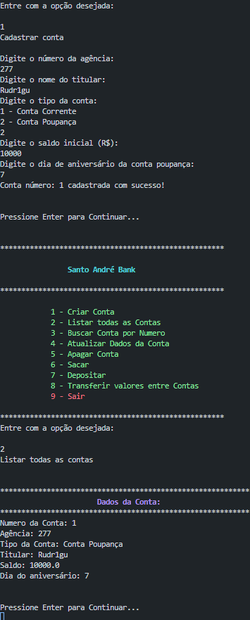

## Conta Bancária - Generation Brasil

Este projeto é uma aplicação Java que simula operações básicas de um sistema bancário. O objetivo é fornecer uma implementação simples de contas bancárias, incluindo contas correntes e poupança, com funcionalidades como saque, depósito, transferência e visualização de saldo. A aplicação segue o padrão MVC (Model-View-Controller) e utiliza conceitos de orientação a objetos, como herança e polimorfismo, para estruturar o código de forma modular e reutilizável.

<details>
    <summary>Imagens</summary>
    <div aling="center">
        
        
        
        
    </div>
</details>

<details>
    <summary>Diagrama de Classe e Objeto</summary>

```java
classDiagram
class Conta {
<<Abstract>>
    - numero : int
    - agencia : int
    - tipo : int
    - titular : String
    - saldo : float
    + int getNumero()
    + int getAgencia()
    + int getTipo()
    + String getTitular()
    + float getSaldo()
    + void setNumero(int numero)
    + void setAgencia(int agencia)
    + void setTipo(int tipo)
    + void setTitular(String titular)
    + void setSaldo(float saldo)
    + boolean sacar(float valor)
    + void depositar(float valor)
    + void visualizar()
}
class ContaCorrente {
    - limite : float
    + float getLimite()
    + void setLimite(float limite)
    + boolean sacar(float valor)
    + void visualizar()
}
class ContaPoupanca {
    - aniversario : int
    + int getAniversario()
    + void setAniversario(int aniversario)
    + void visualizar()
}
class ContaRepository{
    << Interface >>
    + void procurarPorNumero(int numero)
    + void listarTodas()
    + void cadastrar(Conta conta)
    + void atualizar(Conta conta)
    + void deletar(int numero)
    + void sacar(int numero, float valor)
    + void depositar(int numero, float valor)
    + void transferir(int numeroOrigem, int numeroDestino, float valor)
}
class ContaController{
    + void procurarPorNumero(int numero)
    + void listarTodas()
    + void cadastrar(Conta conta)
    + void atualizar(Conta conta)
    + void deletar(int numero)
    + void sacar(int numero, float valor)
    + void depositar(int numero, float valor)
    + void transferir(int numeroOrigem, int numeroDestino, float valor)
    + int gerarNumero()
    + Conta buscarNaCollection(int numero)
}

Conta <|-- ContaCorrente
Conta <|-- ContaPoupanca
Conta <.. ContaRepository
ContaRepository <|.. ContaController
```

</details>


## Menu

```java
public class Menu {
    public static void main(String[] args) {
        Scanner scanner = new Scanner(System.in);
        
        int opcao;
        boolean isRunning = true;

        while (isRunning) {
            MenuView.menuPrincipal();

            try {
                opcao = scanner.nextInt();
            } catch (InputMismatchException e) {
                System.out.println("\nDigite valores inteiros");
                scanner.nextLine();
                continue;
            }
            switch (opcao) {
                case 1:
                    ContaServices.cadastrarConta();
                    KeyPress.keyPress();                   
                    break;
                case 2:
                    ContaServices.listarTodas();
                    KeyPress.keyPress();
                    break;
                case 3:
                    ContaServices.buscarPorNumero();
                    KeyPress.keyPress();
                    break;
                case 4:
                    ContaServices.atualizarConta();
                    KeyPress.keyPress();
                    break;
                case 5:
                    ContaServices.deletarConta();
                    KeyPress.keyPress();
                    break;
                case 6:
                    ContaServices.sacar();
                    KeyPress.keyPress();
                    break;
                case 7:
                    ContaServices.depositar();
                    KeyPress.keyPress();
                    break;
                case 8:
                    ContaServices.transferir();
                    KeyPress.keyPress();
                    break;
                case 9:
                    MenuView.sobre();
                    System.out.println("Saindo...");
                    KeyPress.keyPress();
                    isRunning = false;
                    break;
                default:
                    System.out.println("Opção inválida");
                    break;
            }
        }
        scanner.close();
    }
}
```